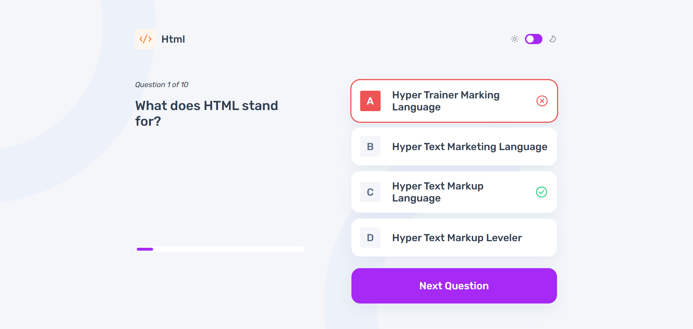

# Frontend Mentor - Frontend quiz app solution

This is a solution to the [Frontend quiz app challenge on Frontend Mentor](https://www.frontendmentor.io/challenges/frontend-quiz-app-BE7xkzXQnU). Frontend Mentor challenges help you improve your coding skills by building realistic projects.

## Table of contents

- [Overview](#overview)
  - [The challenge](#the-challenge)
  - [Screenshot](#screenshot)
  - [Links](#links)
- [My process](#my-process)
  - [Built with](#built-with)
  - [What I learned](#what-i-learned)
  - [Continued development](#continued-development)

## Overview

### The challenge

Users should be able to:

- Select a quiz subject
- Select a single answer from each question from a choice of four
- See an error message when trying to submit an answer without making a selection
- See if they have made a correct or incorrect choice when they submit an answer
- Move on to the next question after seeing the question result
- See a completed state with the score after the final question
- Play again to choose another subject
- View the optimal layout for the interface depending on their device's screen size
- See hover and focus states for all interactive elements on the page
- Navigate the entire app only using their keyboard
- **Bonus**: Change the app's theme between light and dark

### Screenshots





### Links

- Solution URL: [https://github.com/skhbabez/frontend-quiz-app/](https://github.com/skhbabez/frontend-quiz-app/)
- Live Site URL: [https://skhbabez.github.io/frontend-quiz-app/](https://skhbabez.github.io/frontend-quiz-app/)

## My process

### Built with

- Semantic HTML5 markup
- CSS custom properties
- Flexbox
- CSS Grid
- Mobile-first workflow

### What I learned

I feel I finally got a good grasp of how to make my css stylings more component based, using nested css selectors more meaningfully. I also managed to make my spacings and font sizes meaningfully responsive, makong better use of clamp. In javascript I decided to experiment with rendering using only the most basic api for a change, using create.Element. This was painful but extremely educational. I am somewhat proud of how I solved the dark light mode issue not having to utilize javascript. While this solution is probably not particularly backwards compatible, it was interesting too see what you can achieve with little modern css.

```css
html:has(.dark-toggle input:checked) {
  --bg-img: var(--bg-mobile-dark);
  /*omitted lines*/
}
```

```html
<div class="dark-toggle">
  <label>
    <input type="checkbox" aria-label="turn on dark mode" />
  </label>
</div>
```

Initially I added the icons through css but realized the json was providing us with an image url. While my original solution felt a lot more elegant, it was not particularly dynamic. Adding the image trhough javascript ended up being easy enough and allowed for dynamic rendering.

```js

  createLabel(url, color = "accessibility") {
    const label = document.createElement("span");
    label.classList.add("icon", `icon-${color}`);
    const img = document.createElement("img");
    img.setAttribute("src", url);
    img.setAttribute("alt", "");
    label.appendChild(img);
    return label;
  }
```

### Continued development

I am not particularly happy with my javascript code as it ended up far too complicated. This experiment really showed me the value of frameworks like react. Next time I might try using templates instead, seeing if I can make my html more reusable without sacrificing readability and maintainability. Also I used a class mostly to just mess around with javascripts syntax but this was not really necessary for this project nor did it really add anything. I also want to try learning something like sass as wll as focus on modularizing my code more as these projects start becoming to big to have everything in a few files
